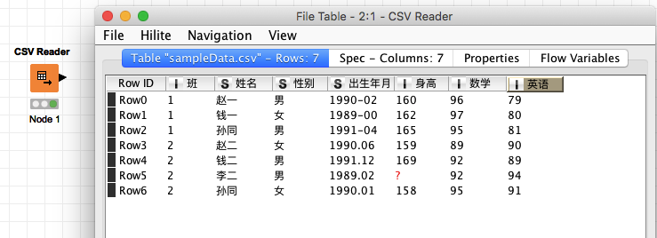
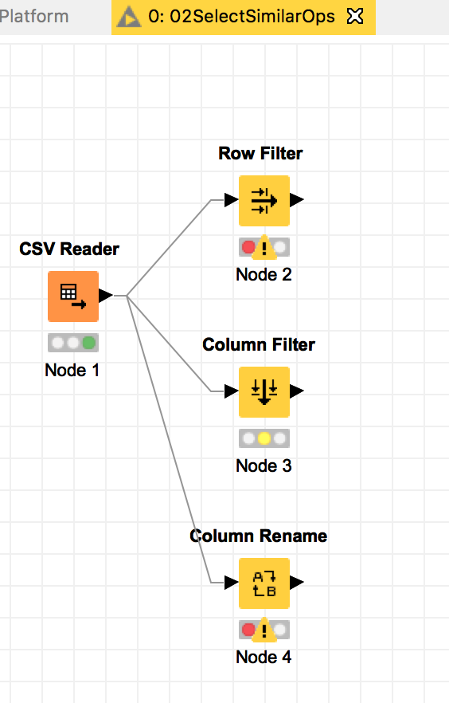

# 数据分析指北

# 配套作业

1. 读取csv并展示, 最终效果为:

knime workflow 下载: [practicalDA_01.knar](https://github.com/HaveF/practicalDA/raw/master/practicalDA_01.knar)

2. 类似SQL的select操作, 下载实践一下:

knime workflow 下载: [practicalDA_02.knar](https://github.com/HaveF/practicalDA/raw/master/practicalDA_02.knar)

