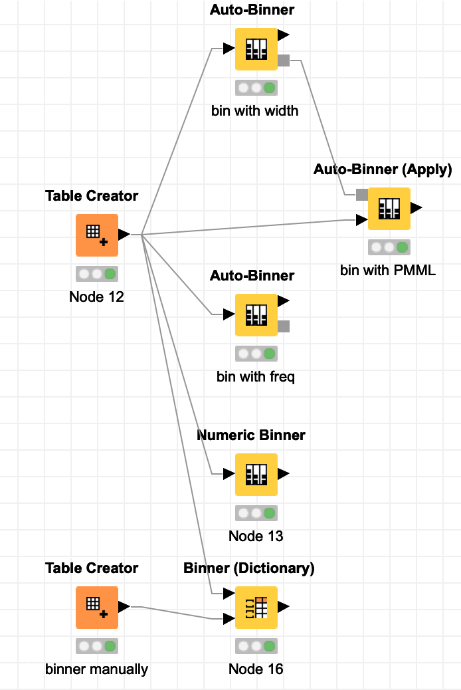

>> 注: 尽管这是老版本的 KNIME 创建的 workflow, 但它仍然能够正常运行.
>> 更多更新的示例 workflow 在路上, 敬请期待(2022/03/22)

# 数据分析指北
todo: toc
todo: how to useissue 

# 配套作业

1. 读取csv并展示, 最终效果为:

knime workflow 下载: [practicalDA_01.knar](https://github.com/HaveF/practicalDA/raw/master/practicalDA_01.knar)

2. 类似SQL的select操作, 下载实践一下:

knime workflow 下载: [practicalDA_02.knar](https://github.com/HaveF/practicalDA/raw/master/practicalDA_02.knar)

3. rule engine and Group by

knime workflow 下载: [practicalDA_03.knar](https://github.com/HaveF/practicalDA/raw/master/practicalDA_03.knar)

6. 泰坦尼克沉船数据分析

a. 之一

knime workflow 下载: [practicalDA_06_01.knar](https://github.com/HaveF/practicalDA/raw/master/practicalDA_06_01.knar)

b. 之二 决策树

knime workflow 下载: [practicalDA_06_02.knar](https://github.com/HaveF/practicalDA/raw/master/practicalDA_06_02.knar)

7. 两种从数据库中获取数据的方法

knime workflow 下载: [practicalDA_07.knar](https://github.com/HaveF/practicalDA/raw/master/practicalDA_07.knar)

8. 练习解析 JSON 与 XML

knime workflow 下载: [practicalDA_08.knar](https://github.com/HaveF/practicalDA/raw/master/practicalDA_08.knar)

9. 练习 Binning/分桶

knime workflow 下载: [practicalDA_09.knar](https://github.com/HaveF/practicalDA/raw/master/practicalDA_09.knar)
